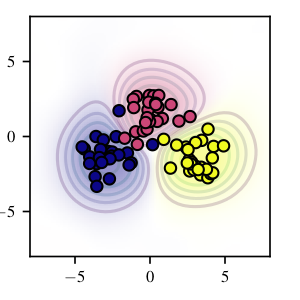
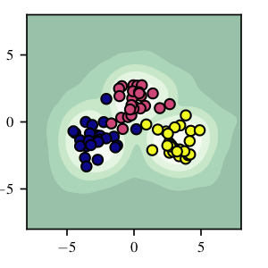

# Reliable Camera Model Identification Using Sparse Gaussian Processes

<p align="center">
    
    
</p>

If you use this implementation, please cite the [paper](https://ieeexplore.ieee.org/abstract/document/9392307): 

```
@ARTICLE{9392307,
  author={B. {Lorch} and F. {Schirrmacher} and A. {Maier} and C. {Riess}},
  journal={IEEE Signal Processing Letters}, 
  title={Reliable Camera Model Identification Using Sparse Gaussian Processes}, 
  year={2021},
  doi={10.1109/LSP.2021.3070206}
}
```

## Prerequisites

1. Set up virtual environment.

```bash
conda env create --name gpc --file=environment.yml
```

2. (Optional) For comparison to the PI-SVM, clone and compile the PI-SVM authors' code from their [GitHub repository](https://github.com/ljain2/libsvm-openset).
Then open `utils.constants.py` and set `constants[LIBSVM_DIR]` to the path where to find the compiled executables.

## Data preparation

1. Download the [Dresden image database](http://forensics.inf.tu-dresden.de/).

2. Extract SPAM features.

Example:
```bash
PYTHONPATH=`pwd` python spam_features/ddimgdb_extract_features.py \
    --output_dir /media/hdd/camera_model_identification \
    --dresden_dir /mnt/nfs/DresdenImageDB
    [--crop CROP_SIZE]
```

This script will store the extracted features as HDF5 file to the given output directory.

## Train Gaussian process classifier

Example:
```bash
PYTHONPATH=`pwd` python experiments/train_spam_gpc.py \
    --dresden_dir /mnt/nfs/DresdenImageDB \
    --features_file $HDD/camera_model_identification/2021_04_13-dresden_spam_features_crop_full_resolution.h5 \
    --logdir $HDD/camera_model_identification/models \
    --num_known_models 10 \
    --max_num_inducing_points 512 \
    --seed 1 \
    --model_selection_seed 91058 \
    --torch_seed 42
```

In our experiments, we trained each GPC five times with different training-test splits. In particular, we set `MODEL_SELECTION_SEED=91058,SEED=$i,TORCH_SEED=42` with `i=1,...,5`.

Note that there are additional arguments with reasonable default values for controlling the model, the data, and the training.

## Evaluation

To evaluate a single trained Gaussian process classifier, you can use `eval_single.py`.

```bash
python experiments/eval_single.py \
    --dresden_dir /mnt/nfs/DresdenImageDB \
    --features_file $HDD/camera_model_identification/2021_04_13-dresden_spam_features_crop_full_resolution.h5 \
    --model_dir $HDD/camera_model_identification/2021_04_14_08_29_42-gpc
```

To evaluate multiple Gaussian process classifiers trained on the same features, you can use `eval_multiple.py`.

For comparison against the PI-SVM and the combined classification framework (CCF, named "secure SVM" in the code), you can use `eval_and_compare_multiple.py`.

## Additional experiments provided in this repository

**Number of inducing points**

1. Train GPC with different numbers of inducing points, see `experiments/torque/train_max_num_inducing_points_woody.sh`.

2. Evaluate trained GPCs, see `experiments/eval_multiple.py`.

**Impact of ROI size**

1. Extract features with different ROI sizes (by running `ddimgdb_extract_features.py` with the `--crop` parameter).

2. Train GPC with features of every ROI size, see `experiments/torque/train_crops_woody.sh`.

3. Evaluate trained GPCs, see `experiments/eval_and_compare_multiple.py`.

**Unseen post-processing**

1. With a trained GPC, run `experiments/eval_postprocessing.py`.

